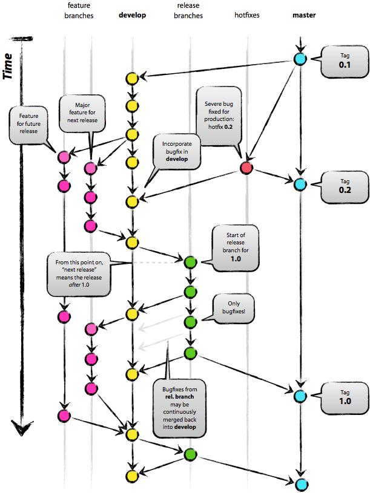
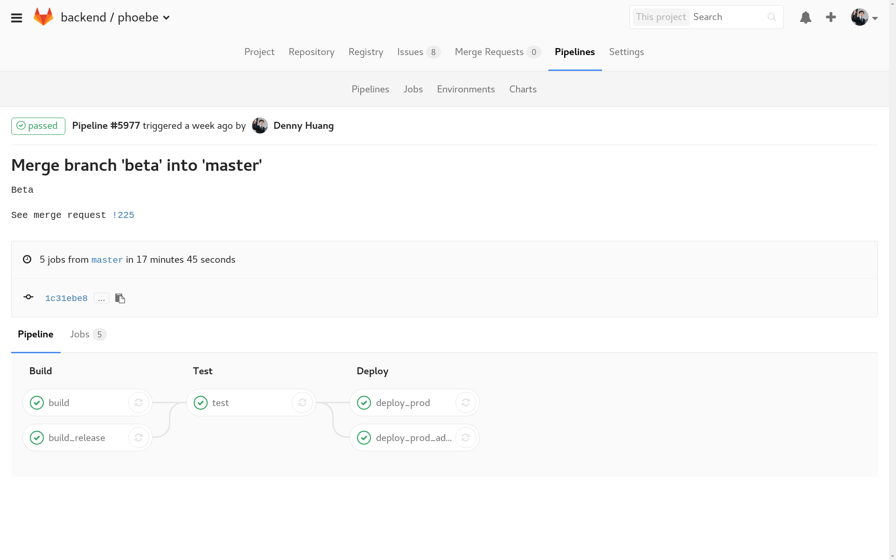

title: 大學時就該知道的 Git 版本控制
output: index.html

--

<h1 style="font-size: 72px">
	大學時就該知道的 
	Git 版本控制
</h1>
 

## Denny Huang
## 2017/04/26

--

### Who am I ?

 
<h2 style="font-size: 60px">
  <b>Denny Huang</b>
</h2>

* 雷亞遊戲 Rayark Inc.

* SITCON 2013, 2014 總召

* <a href="http://about.me/denny0223" target="_blank">About me</a>

--

# [YouTube](https://www.youtube.com/watch?v=eznLhINAvQI)
## git denny

--

# Open Source

--

<iframe width="780" height="500" src="https://www.youtube.com/embed/6NhyCXJU-IQ" frameborder="0" allowfullscreen></iframe>

  
     By Bit Blueprint / Jimmy Huang
  

--

# Free Software, Open Source, FLOSS
## [ref1](http://www.openfoundry.org/tw/legal-column-list/508-2010-07-15-10-50-34) / [ref2](https://www.gnu.org/philosophy/free-software-for-freedom.html)

--

# Richard Stallman

--

# GNU

--

# Linus Torvalds
## Linux

--

# GNU/Linux

--

# 生活中

--

# How to Cowork?

--

# Software Engineering

--

### Waterfall model

* Request and Analysis Phase（需求與分析階段）

* Design Phase（設計階段）

* Coding Phase （撰寫階段）

* Testing Phase（測試階段）

* Maintenance Phase （維護階段）

--

# Git

--

# Git / GitHub
## It&apos;s different

--

# [大教堂和市集](https://zh.wikipedia.org/wiki/%E5%A4%A7%E6%95%99%E5%A0%82%E5%92%8C%E5%B8%82%E9%9B%86)

--

# Mailing list
## [Google Groups](http://groups.google.com/)

--

# [vger.kernel.org](http://vger.kernel.org/)

--

# [LKML](https://lkml.org/)

--

# Issue
## [wrong example](https://github.com/nwjs/nw.js/issues/293)
## [維護一個大型開源項目是怎樣的體驗？](https://www.zhihu.com/question/36292298/answer/160028010)

--

# Example: AOSP
## [Report Bugs](https://source.android.com/source/report-bugs)

--

# Pull Request
## [git-it](https://github.com/jlord/git-it/blob/master/README-zhtw.md)

--

# Branch

--

  

--

### Contribution is easy
Kernel commit -  
4 year old girl fixes formatting to make 's' happy 
 
 
[ref](http://git.kernel.org/cgit/linux/kernel/git/torvalds/linux.git/commit/?id=690b0543a813b0ecfc51b0374c0ce6c8275435f0)

--

<h1 style="font-size: 48px">
	Open Source Your Project
</h1>

--

# [Scrabble](https://github.com/denny0223/scrabble)

--

# License

  <a href="http://www.openfoundry.org/tw/licenses" target="_blank">授權條款介紹 - OpenFoundry</a>

--

# CI / CD
## Continuous Integration / Continuous Delivery

--

  

--

### 10 year

* <a href="https://www.atlassian.com/git/articles/10-years-of-git/" target="_blank">10 Years of Git</a>

* <a href="http://ithome.com.tw/news/95088" target="_blank">Git 十歲了！Git 之父 Linus Torvalds 說古，大談 Git 的起源</a>

--

# Community

--

<h1 style="font-size: 64px">
  [臺灣 自由/開源 軟硬體 社群列表](https://www.mindmeister.com/hk/303031964/open-source-community-map-in-taiwan)
</h1>

--

# Q & A

--

<h1 style="font-size: 72px">
  Thanks for listening!
</h1>

   

  

<h2 style="font-size: 18px">
本投影片採用<a href="http://creativecommons.org/licenses/by-sa/3.0/tw/" target="_blank">創用 CC「姓名標示—相同方式分享 3.0 台灣」授權條款</a>
</h2>

