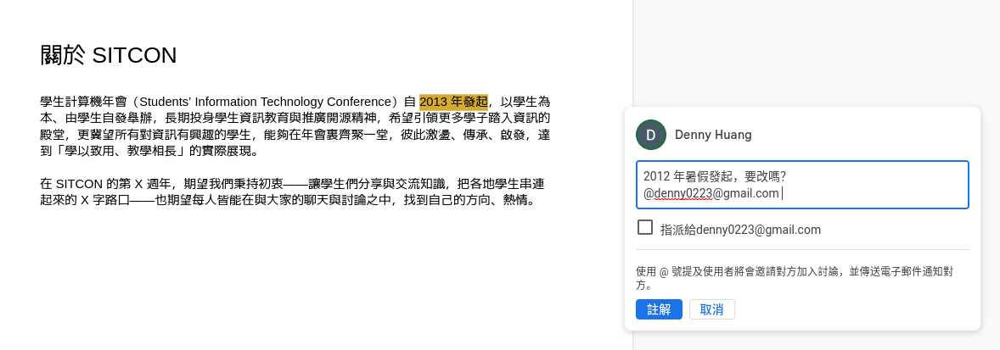

title: 協作不想吵架？快用版本控制系統！
output: index.html

--

<h1 style="font-size: 72px">
	協作不想吵架？ 
	快用版本控制系統！
</h1>
 

## Denny Huang

--

### Who am I ?

 
<h2 style="font-size: 60px">
  <b>Denny Huang</b>
</h2>

* 雷亞遊戲 Rayark Inc.

* <a href="https://sitcon.org/" target="_blank">SITCON 學生計算機年會</a> 共同發起人

* <a href="https://denny.one/" target="_blank">https://denny.one/</a>

--

### Tips
- 預錄影片
	- 暫停/快轉/倒帶/兩倍速
- Slack 提問
	- 頻道
		- #edu-camp
		- #edu
	- 呼喚講師 @denny

--

<h1 style="font-size: 48px">
[denny.one/git-g0v-sch001/](https://denny.one/git-g0v-sch001/)
</h1>

--

### 常見慘案

   
  

--

### 甚至更慘的

   
   
   
  

--

### 專案

- 專案資料
	- 文件
	- 程式碼
- 溝通平台
- 事件/議題管理
- 接收意見及回饋

--

<h1 style="font-size: 72px">
  線上協作 / 版本控制
</h1>

--

### 誰？改了什麼？

   
  

--

### 動手之前，充分討論，釐清權責人

   
  

--

### 提出修改，並充分說明原因

   
  

--

# 軟體開發

--

### Linus Torvalds

   
  

  
  	From Wikimedia Commons, by Krd
  

--

### Linux

   
  

--

# Git

--

# Git / GitHub
## It&apos;s different

--

### Git
版本控制系統軟體，供本機使用。

### [GitHub](https://github.com/)
程式碼託管平台，可以將 Git 版本庫（repository）存放到此並與他人一同協作，也提供議題管理（Issue Tracking）、[網頁代管（GitHub Pages）](https://pages.github.com/)等服務。

### [GitLab](https://gitlab.com/)
與 GitHub 功能相似的另一選擇，專案管理及 [CI/CD （持續集成和持續交付）](https://zh.wikipedia.org/zh-tw/CI/CD)功能十分優異。

--

# 專案管理實例

--

### 軟體專案 - [OPass](https://opass.app/) Android

- 專案資料
	- [文件](https://hackmd.io/@OPass)
	- [程式碼](https://github.com/CCIP-App/CCIP-Android)
- 溝通平台
	- 開發團隊 Telegram 群組
- 事件/議題管理
	- [GitHub Issue](https://github.com/CCIP-App/CCIP-Android/issues)
- 接收意見及回饋
	- Google Play 評價
	- [GitHub Pull Request](https://github.com/CCIP-App/CCIP-Android/pulls?q=is%3Apr+is%3Aclosed)

--

### 活動專案 - [SITCON 學生計算機年會](https://sitcon.org)
- 專案資料
	- [文件](https://hackmd.io/@SITCON/doc)
	- [程式碼](https://github.com/sitcon-tw/)
- 溝通平台
	- [Mailing List](https://groups.google.com/g/sitcon-general/)
	- 工作人員 Telegram 群組
- 事件/議題管理
	- [GitLab Issue Board](https://gitlab.com/sitcon-tw/2022/2022-board/-/boards)
- 接收意見及回饋
	- 會後問卷及社群媒體

--

# [YouTube](https://www.youtube.com/watch?v=eznLhINAvQI)
## git denny

--

### [Git-it](https://www.electronjs.org/apps/git-it)
一步步教學，從安裝 Git 開始學會基本操作建立版本庫開始程式碼版本控制，並推送到 GitHub 上能夠與他人協作。

後半段為副本他人專案，並提供修改建議得到採納。

 
## [走完教學，在這看到自己的名字吧！](https://jlord.github.io/patchwork/)

--

### 安裝 Git 並在本地操作推送到 GitHub

1. Get Git

1. Repository

1. Commit To It

1. GitHubbin

1. Remote Control

  
  	若需中文翻譯，可參考[專案原始碼](https://github.com/jlord/git-it-electron/tree/2f24d94094eb100cc0c643eae3f819ee7c51ba99/resources/contents/zh-TW/challenges)
  

--

### 副本他人專案並提出修改

6. Forks And Clones

6. Branches Aren't Just For Birds

6. It's A Small World

6. Pull Never Out Of Date

6. Requesting You Pull Please

6. Merge Tada

  
  	若需中文翻譯，可參考[專案原始碼](https://github.com/jlord/git-it-electron/tree/2f24d94094eb100cc0c643eae3f819ee7c51ba99/resources/contents/zh-TW/challenges)
  

--

### 10 year

* <a href="http://ithome.com.tw/news/95088" target="_blank">Git 十歲了！Git 之父 Linus Torvalds 說古，大談 Git 的起源</a>

* <a href="https://www.atlassian.com/git/articles/10-years-of-git/" target="_blank">10 Years of Git</a>

--

# License

  <a href="https://ossf.denny.one/tw/licenses" target="_blank">授權條款介紹 - OpenFoundry</a>

--

# [OSCVPass](https://oscvpass.ocf.tw/)

--

# Q & A

--

<h1 style="font-size: 72px">
  Thanks for listening!
</h1>

   

  

<h2 style="font-size: 18px">
本投影片採用<a href="http://creativecommons.org/licenses/by-sa/3.0/tw/" target="_blank">創用 CC「姓名標示—相同方式分享 3.0 台灣」授權條款</a>
</h2>

